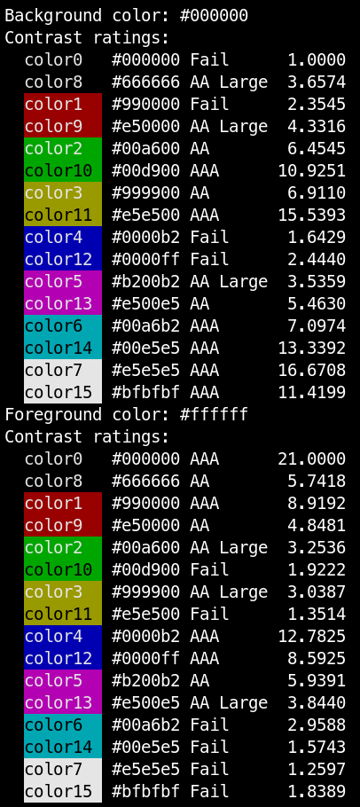
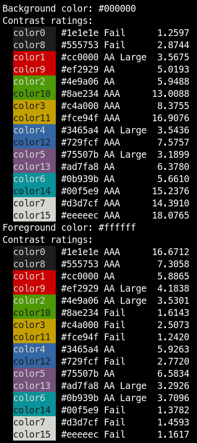
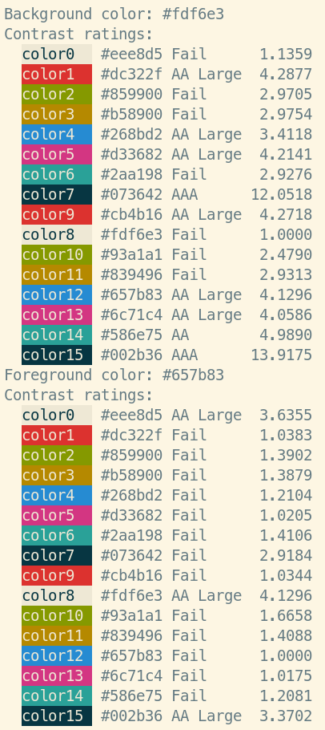
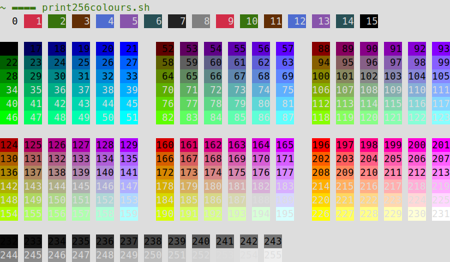
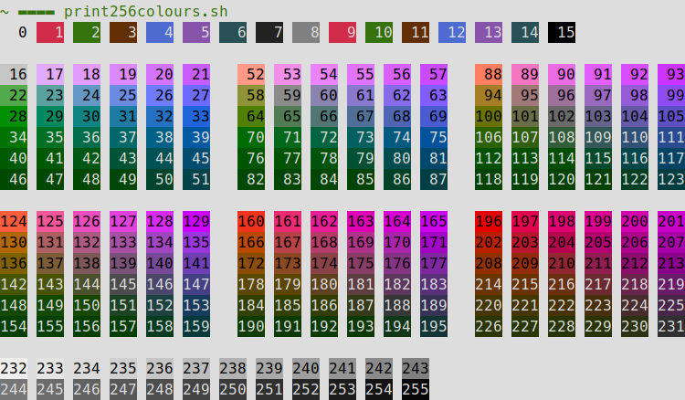

# WCAG-Terminal-Checker

Outputs contrast values between colors in a Xresources color scheme against it's background and foreground colors.

Information on contrast tests: http://accessibility.psu.edu/color/contrasthtml/

## Requirements

All dependencies are provided, you only need [Node.js](https://nodejs.org/) to run the script.

## Usage

```
# Input files: https://github.com/nevesnunes/env/tree/master/linux/.local/share/Xresources
node index.js file
```

## Limitations

- Only supports themes with 16 colors
- Colors must be formatted as `#rrggbb` or `rgb:rr/gg/bb`

## Examples

**Xterm**:



Notice how the blue color fails the contrast test against the black background. This matches with the general difficulty in reading blue text with this theme.

**Tango**:



**Solarized Light**:



## Related Work

- [adjust256colors.py - corrects contrast of 256 colors for light themes](https://github.com/nevesnunes/env/tree/master/linux/bin/adjust256colors.py)
    - Before correction:
        - 
    - After correction (text using higher color indexes will be readable on light backgrounds):
        - 
- [chriskempson/base16: An architecture for building themes](https://github.com/chriskempson/base16)
- [Solarized - Features](https://ethanschoonover.com/solarized/#features)
- [reasoning about colors - color spaces and styling guidelines](http://notes.neeasade.net/color-spaces.html)
